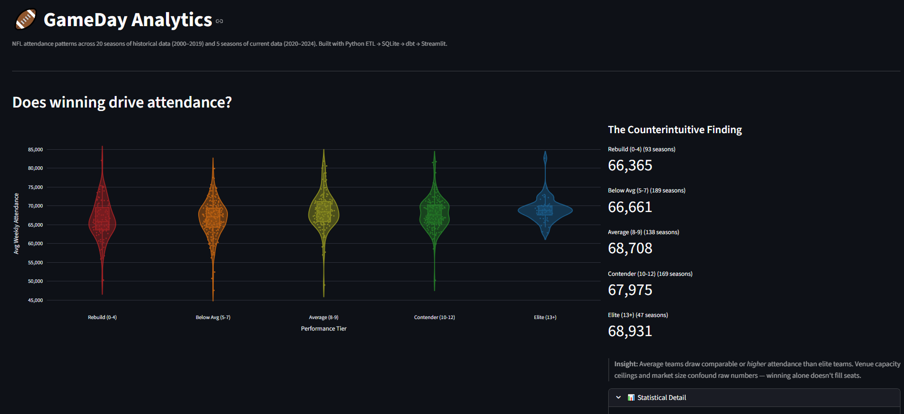

# GameDay Analytics — Multi-Source Data Platform

> Simulates leading a data engineering initiative from discovery through production: stakeholder-driven requirements, multi-source ETL integration, collaborative schema design, and analytical validation.

**Core Challenge:** Integrate historical (Kaggle 2000-2019) and current (ESPN API 2020-2024) NFL data with mismatched schemas, team relocations, and inconsistent naming—then build analysis-ready models for business questions.

**Technical Approach:**
- Multi-source ETL pipeline with data quality controls
- Automated JSON schema flattening and semantic categorization (339 ESPN fields → 98 curated columns across 7 themed tables)
- dbt transformation layer (15 models, 26 data quality tests)
- Iterative design workflow simulating cross-functional collaboration (see `/notebooks/` for analyst-engineer handoff process)

**Skills Demonstrated:**
- Python ETL (Kaggle API, ESPN REST API, CSV reference tables)
- Data modeling (dimensional design, slowly-changing dimensions for relocations)
- SQL transformation logic (window functions, CTEs, aggregations)
- Analytical validation (correlation analysis, cohort comparisons, variability metrics)
- Technical documentation (dbt yml specs, notebook narratives, README architecture docs)

---

## 📊 Project Architecture

```
Kaggle CSV (2000-2019)  ─┐
ESPN API (2020-2024)     ├─→ Python ETL ─→ SQLite Raw Tables ─→ dbt Models ─→ Analysis Marts
Team Reference CSV      ─┘                    (10 tables)        (15 models)     (3 marts)
```



**Key Design Decisions:**

1. **SQLite for MVP** (not Postgres): Entire dataset <2MB, enables local development without Docker overhead. Production would use Postgres+PostGIS for geospatial queries.

2. **dbt for transformations** (not Python): Declarative SQL models with built-in testing, version control for analytics logic, easier for non-engineers to review.

3. **Themed staging tables**: Flattened ESPN's nested JSON into 7 semantic schemas (core, publicity, stats, venue, time, team_attributes, score_wins) to support varied analytical questions without creating one massive denormalized table.

4. **Curated reference table**: Manually maintained CSV for team relocations/rebrands—pragmatic choice for small, slowly-changing dataset. Automated validation catches mapping errors.

---

## 🔍 Iterative Design Process (Technical Highlight)

**Problem:** ESPN API returns 339 nested JSON fields per game. How do you decide which to keep?

**Solution:** Simulated analyst-engineer collaboration workflow:

1. **Automated schema discovery** `/notebooks/02_view_design.ipynb`
   - Recursive JSON flattening preserving ESPN's field ordering
   - Keyword-based theme suggestion (publicity, stats, venue, etc.)
   - Automated exclusion of redundant fields (UIDs, display values, link metadata)


2. **Human review layer**: Generated CSV with sample data for "analyst" to annotate (include/exclude, rename, validate themes)

3. **Validation queries** (`/notebooks/03_dbt_mart_validation.ipynb`):
   - Constant-value field detection (found 9 fields always same value across 1,452 games)
   - Cardinality analysis (broadcasts, geolocation, etc.)
   - Data quality checks before finalizing schema

**View on nbviewer**
   - [01_exploratory_analysis.ipynb](https://nbviewer.org/github/sooperD00/GameDay_Analytics/blob/main/notebooks/01_exploratory_analysis.ipynb)
   - [02_view_design.ipynb](https://nbviewer.org/github/sooperD00/GameDay_Analytics/blob/main/notebooks/02_view_design.ipynb)
   - [03_dbt_mart_validation.ipynb](https://nbviewer.org/github/sooperD00/GameDay_Analytics/blob/main/notebooks/03_dbt_mart_validation.ipynb)

**Result:** 98 curated columns with clear semantic grouping, ready for dbt modeling.

*(This process demonstrates requirements engineering, data quality thinking, and pragmatic architecture—not just "run a script.")*

---

## 📈 Sample Analytical Findings

**Q1: Does winning drive attendance?**
- Winning teams (10+ wins): 68,183 avg attendance
- Average teams (8-9 wins): **68,708 avg** ← *higher!*
- **Insight:** Venue capacity ceiling + market size confound raw numbers. Need to normalize by capacity.

**Q2: Do playoff teams get attendance boost?**
- Playoff teams: +3.0% avg increase next year
- Non-playoff teams: +3.2% avg increase ← *comparable!*
- **Insight:** Attendance driven more by stadium upgrades, star signings, pricing than recent playoff runs.

**Q3: Does indoor vs outdoor affect stability?**
- Indoor: 74.5% variability
- Outdoor: 76.5% variability
- **Insight:** Weather doesn't dominate—opponent quality and market factors matter more.

*(See [03_dbt_mart_validation.ipynb](https://nbviewer.org/github/sooperD00/GameDay_Analytics/blob/main/notebooks/03_dbt_mart_validation.ipynb) for full analysis + methodology)*

---

## 🛠️ Tech Stack

| Component | Choice | Why |
|-----------|--------|-----|
| **ETL** | Python (pandas, requests) | API integration, CSV processing, flexible transformations |
| **Storage** | SQLite | Local dev simplicity, <2MB dataset, version control friendly |
| **Transforms** | dbt Core | SQL-based models, testing framework, Git-friendly analytics |
| **Analysis** | Jupyter + SQL | Exploratory work, validation queries, documentation |
| **API** | ESPN undocumented endpoints | Free, current data, required reverse-engineering |

---

## 🚀 Quick Start

```bash
# Clone
git clone https://github.com/sooperD00/GameDay_Analytics.git
cd GameDay_Analytics

# Install dependencies
pip install -r requirements.txt

# Run full pipeline
bash run_pipeline.sh
```

Or run steps individually
```bash
# ETL pipeline (downloads Kaggle + ESPN data)
python -m src.etl.ingest_nfl_dataset
python -m src.etl.ingest_current_season
python -m src.etl.create_team_reference
python -m src.etl.load_to_database

# Run dbt transformations
cd dbt_project
dbt seed    # loads team reference mapping
dbt run     # builds staging → intermediate → marts pipeline
dbt test    # 26/26 tests should pass
```

Explore results
```bash
sqlite3 ../data/processed/nfl_attendance.db
> SELECT * FROM mart_win_attendance_correlation LIMIT 5;
```

**Or just explore the notebooks:**
- `/notebooks/01_exploratory_analysis.ipynb` — Initial EDA + data integration validation
- `/notebooks/02_view_design.ipynb` — Schema design collaboration simulation
- `/notebooks/03_dbt_mart_validation.ipynb` — Analytical findings + methodology

---

## 📁 Project Structure
```
GameDay_Analytics/
├── README.md
├── run_pipeline.sh              # single-command pipeline execution
├── src/                         # Python ETL — ingestion only
│   ├── etl/                     # ingestion scripts + SQL view definitions
│   └── utils/                   # config.py, logging_config.py
├── dbt_project/
│   ├── seeds/                   # team_reference_seed.csv (relocation mapping)
│   ├── models/
│   │   ├── staging/             # raw → clean (7 models + 4 future)
│   │   ├── intermediate/        # joins + window functions (2 models)
│   │   └── marts/               # analytical tables (3 models)
│   └── tests/                   # cross-source validation
├── notebooks/                   # EDA, schema design narrative, mart validation
├── data/
│   ├── sample/                  # sample CSVs for quick exploration
│   └── raw/                     # (gitignored) full datasets
└── docs/                        # extended documentation
```

**For hiring managers evaluating technical thinking:**

1. **[`/notebooks/02_view_design.ipynb`](https://nbviewer.org/github/sooperD00/GameDay_Analytics/blob/main/notebooks/02_view_design.ipynb)** ⭐ — Shows how I designed the 7-table schema through iterative refinement
2. **[`/notebooks/03_dbt_mart_validation.ipynb`](https://nbviewer.org/github/sooperD00/GameDay_Analytics/blob/main/notebooks/03_dbt_mart_validation.ipynb)** ⭐ — Demonstrates analytical rigor + business communication
3. **`/dbt_project/models/`** — Full staging → intermediate → marts pipeline with 26 data quality tests
4. **`/src/etl/`** — Production-style ETL with logging, error handling, idempotency

---

## 💡 What I'd Change at Scale

- **Postgres + Airflow**: SQLite → Postgres for concurrency; Python scripts → Airflow DAGs for scheduling
- **Incremental loads**: Current ETL is full refresh; add change data capture for ESPN API
- **Data catalog**: Document lineage, add metadata layer (dbt docs covers some of this)
- **Observability**: Add monitoring for API rate limits, data freshness, pipeline failures
- **Testing pyramid**: Expand dbt tests to include distribution checks, referential integrity across sources

---

## 🎯 Project Philosophy

This project demonstrates senior-level technical thinking:

- **Requirements translation**: Vague business question → concrete data architecture
- **Pragmatic choices**: SQLite for MVP (not over-engineering), dbt for testability (not bespoke Python)
- **Iterative refinement**: Schema design through collaboration, not upfront perfect planning
- **Production awareness**: Logging, error handling, idempotency built-in from start
- **Scale thinking**: Clear articulation of "what changes at 10x volume"

The fictional team personas (Linda, Ronald, Walter, Florence, Grace) represent different stakeholder perspectives I had to balance—data quality rigor, analytical needs, documentation clarity, statistical validity. Real data projects require synthesizing these viewpoints into coherent architecture.

---

## 📬 Contact

- **Developer:** Nicole Rowsey
- **LinkedIn:** [linkedin.com/in/nicole-rowsey](https://linkedin.com/in/nicole-rowsey)
- **Other Projects:** [ORToothFairy](https://github.com/sooperD00/ORToothFairy) (cross-platform .NET MAUI app)

Currently seeking senior IC / data platform engineering roles. Open to discussing technical architecture, data modeling, or this project's design decisions.

---

**Built with Python, dbt, and iterative thinking** | [Explore Notebooks](notebooks/) | [View SQL Models](dbt_project/models/)
